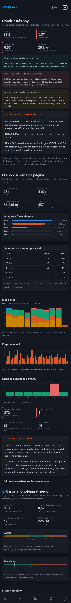
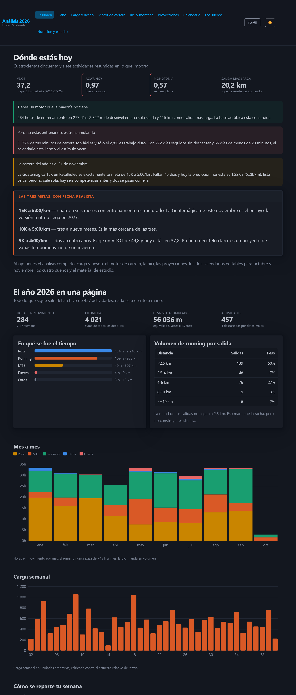

# Análisis 2026 · Emilio

Página de análisis de entrenamiento y planificación, alimentada por tus propios datos de Strava.
Todo el cálculo ocurre en el navegador; el conector sólo descarga y transforma.

## Capturas

<p align="center"> </p>

```
Strava API  →  connector/sync.mjs  →  data/raw/*.json  →  connector/build.mjs  →  ano2026_datos.min.json  →  index.html
```

> **Versión 0.9.0** · ver [CHANGELOG.md](CHANGELOG.md)

## Los datos son públicos a propósito

`ano2026_datos.min.json` está en el repositorio como **ejemplo real** de un análisis de ciencia del deporte aplicado
a Strava: es el resultado de `connector/build.mjs` con las actividades de 2026 de su autor, y toda esa información
ya es visible en su perfil de Strava. Puedes abrir la página y verla funcionando sin configurar nada.

Para analizar **tus** datos, sigue los pasos de abajo: el conector genera tu propio JSON y lo sobrescribe.
Nunca se publican las credenciales (`connector/.env`, `.tokens.json`) ni el crudo de la API (`data/raw/`, que incluye trazados GPS).

## Qué mide

| Módulo | Contenido |
|---|---|
| Resumen y año | Totales, horas por deporte, hábitos, composición semanal y **«Lo que te toca hoy»** (la sesión del día con su detalle por deporte y comparación contra Strava) |
| Carga | Carga diaria, monotonía de Foster, ACWR (EWMA), recuperaciones |
| Running | VDOT de Daniels, ritmos de entrenamiento, metas, zonas por frecuencia cardiaca, eficiencia aeróbica y deriva |
| Bici | VAM, desnivel, MTB frente a ruta |
| Proyecciones | Corto, mediano y largo plazo |
| Calendario | **Tres caminos** (estructurado, intermedio y brutal) sobre las seis competencias. Cada día abre el **detalle de la actividad por deporte** —ritmo objetivo al correr, intensidad en bici (RPE/zonas/FTP) y rutina de fuerza— y un **registro real** para anotar lo que hiciste de verdad (con el % de desvío plan vs realidad). Exportable a `.ics` |
| Sueños | Maratón, 2.000 m D+, 150–200 km, mini Ironman |
| Cuerpo 360 | Escáner corporal: medidas, % de grasa estimado y rutas de composición (ver abajo) |
| Ciencia | Lactato, ultradistancia, combustible en carrera, suplementos y comidas favoritas |
| Preparación | Qué hacer 15, 10 y 5 días antes de cada evento del calendario |
| Registro | Registro de comidas con foto hacia un endpoint PHP (ver abajo) |
| Recursos | Nutrición, recuperación y lecturas con enlaces verificados |

La FC sólo existe en las actividades donde el dispositivo la registró; la página indica la cobertura real.
Si conoces tu FC máxima, ponla en **Perfil**: las zonas se recalculan.

## Versionado

[SemVer](https://semver.org/lang/es/) con una etiqueta `vX.Y.Z` por hito. Mientras sea `0.x`, el esquema del JSON
puede cambiar entre versiones menores; el `CHANGELOG.md` lo indica.

## Puesta en marcha (una sola vez)

Necesitas **Node 20 o superior**. No hay dependencias que instalar.

### 1. Crear tu aplicación de Strava

En <https://www.strava.com/settings/api> crea "My API Application":

| Campo | Valor |
|---|---|
| Category | Data Importer |
| Website | `http://localhost:8000` |
| **Authorization Callback Domain** | **`localhost`** (exactamente eso, sin `http://` ni puerto) |

Apunta el **Client ID** y el **Client Secret**.

### 2. Configurar el conector

```bash
cp connector/.env.example connector/.env
# edita connector/.env y pega STRAVA_CLIENT_ID y STRAVA_CLIENT_SECRET
```

`connector/.env` y `connector/.tokens.json` están en `.gitignore`. **No los subas a ningún sitio.**

### 3. Autorizar

```bash
node connector/auth.mjs
```

Se abre el navegador, aceptas y la terminal confirma la conexión. Concede **"Ver todas tus actividades,
incluidas las privadas"**: sin ese permiso faltarán entrenamientos.

### 4. Descargar y generar

```bash
node connector/sync.mjs          # descarga incremental (la 1.ª vez tarda; después, segundos)
node connector/build.mjs --js    # genera ano2026_datos.min.json y datos.js
```

### 5. Ver la página

```bash
node connector/serve.mjs
```

Imprime una dirección `http://localhost:8000` y otra de tu red local para abrirla **en el móvil**
(la página está diseñada para pantalla pequeña primero).

Si prefieres abrir `index.html` con doble clic, funciona siempre que hayas generado `datos.js`
con `build.mjs --js`: el navegador bloquea `fetch` sobre `file://`, y `datos.js` esquiva esa limitación.

## Uso diario

```bash
node connector/sync.mjs && node connector/build.mjs --js
```

o, desde `connector/`, `npm run actualizar`.

## Publicar en Google Cloud Storage

```bash
# una sola vez
gcloud auth login
gcloud config set project TU-PROYECTO
gcloud storage buckets create gs://TU-BUCKET --location=us-central1 --uniform-bucket-level-access
gcloud storage buckets add-iam-policy-binding gs://TU-BUCKET --member=allUsers --role=roles/storage.objectViewer
gcloud storage buckets update gs://TU-BUCKET --web-main-page-suffix=index.html --web-error-page=index.html

# y luego, cada vez
# (pon GCS_BUCKET=TU-BUCKET en connector/.env)
node connector/deploy.mjs --simular   # enseña los comandos sin ejecutarlos
node connector/deploy.mjs
```

Sube sólo `index.html`, `ano2026_datos.min.json` y `assets/`. Nunca `.env`, `.tokens.json` ni `data/raw/`.

> **Ojo con publicarlo**: el bucket queda accesible para cualquiera que tenga el enlace. Son tus datos de
> entrenamiento, con fechas y lugares. Si no quieres eso, quédate con `serve.mjs` en tu red local.

## Exportar el calendario a Google Calendar

Dentro del módulo **Calendario** tienes dos salidas, para el camino que tengas activo (estructurado, intermedio o brutal):

- **Descargar .ics** — el archivo que importas en Google Calendar (*Configuración → Importar y exportar*),
  en Apple Calendar o en Outlook. Crea los 57 días como eventos de todo el día.
- **Añadir a Google Calendar** — un enlace por día, por si sólo quieres meter las carreras.

## Estructura

| Ruta | Qué es |
|---|---|
| `index.html` | El armazón: carga los estilos y los módulos. |
| `index.original.html` | La versión estática original, guardada por si acaso. |
| `assets/pico.css` | Pico.css, el framework de base. |
| `assets/app.css` | La capa propia, móvil primero. |
| `assets/core.js` | Formato de números, fechas y estadística. |
| `assets/charts.js` | Gráficas en SVG, sin librerías. |
| `assets/metrics.js` | El motor: carga, ACWR, monotonía, VDOT, zonas. |
| `assets/plan.js` | Los tres planes, los tipos de sesión, las rutinas de fuerza y las seis carreras. |
| `assets/actividad.js` | El detalle de cada actividad por deporte (ritmo e intensidad objetivo), reutilizado en el calendario y en «Lo que te toca hoy». |
| `assets/modules/*.js` | Un archivo por módulo de la página. |
| `connector/` | OAuth, descarga, transformación, servidor y despliegue. |
| `data/raw/` | El crudo de la API. No se versiona: se regenera. |

## Si algo falla

| Síntoma | Causa |
|---|---|
| `Faltan STRAVA_CLIENT_ID…` | No creaste `connector/.env` a partir del ejemplo. |
| Strava devuelve `redirect_uri` inválido | El *Callback Domain* de tu app no es exactamente `localhost`. |
| `No hay sesión de Strava` | Ejecuta `node connector/auth.mjs` antes que `sync.mjs`. |
| La página dice que no encuentra los datos | Abriste `index.html` con doble clic sin generar `datos.js`. Usa `build.mjs --js` o `serve.mjs`. |
| Sin VDOT ni mejores esfuerzos | Sincronizaste con `--sin-detalle`. Los 1k/5k vienen del detalle de cada carrera. |
| `límite de la API alcanzado` | Strava permite 100 peticiones cada 15 min. El conector espera solo; déjalo correr. |

## Datos inconsistentes

`build.mjs` marca y excluye de las estadísticas las actividades con datos imposibles (entradas manuales
duplicadas, tiempos corruptos, ritmos de GPS disparatado) y las lista al terminar. Si no estás de acuerdo
con alguna, crea `connector/anomalias.json`:

```json
{ "14321234567": "motivo por el que la excluyo", "14399999999": null }
```

`null` rehabilita una actividad que el detector marcó por error.

## Cuerpo 360 (experimental)

Escáner corporal: pon las fotos y un `measurements.txt` (`waist=37in`, `weight=77kg`, `height=1.70mts`, `age`, `gender`…) en `data/body360/<atleta>/<fecha>/`, añade las cajas de cara en `connector/caras.json` y ejecuta `python connector/body360.py` (sólo Pillow). El script difumina la cara (pixelado + desenfoque), borra EXIF/GPS y genera `body360.js`; el módulo calcula IMC, cintura/talla, % de grasa estimado (CUN-BAE y Deurenberg) y dos rutas (normal y brutal), con nutrición guatemalteca, sueño, estrés y fuerza. Los originales (con cara) están en `.gitignore`; sólo se publican las copias difuminadas y las medidas, por decisión del autor.

## Registro de comidas (PHP)

Copia `registro/config.example.php` como `registro/config.php` en el hosting (no se versiona) y pon un token largo; el mismo token se escribe una vez en el módulo Registro. Para evaluar la semana en local agrega `COMIDAS_URL` y `COMIDAS_TOKEN` a `connector/.env` y ejecuta `node connector/comidas.mjs`: crea `data/comidas/resumen-<fecha>.md` con las fotos, listo para pasárselo a la IA.

## Licencia

[MIT](LICENSE) © 2026 Emilio Dominguez. Los datos de ejemplo son del propio autor; el logotipo de Strava no se redistribuye.
